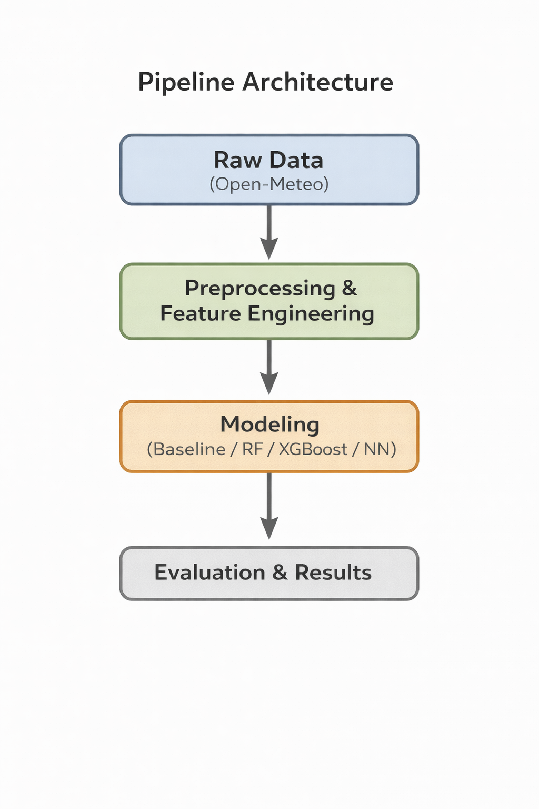

---
# Weather DS Portfolio

## Objective
Predict **daily precipitation (mm)** using physically motivated meteorological variables obtained from a production-grade weather API.

The project is fully:
- Reproducible
- Config-driven
- Test-covered
- Pipeline-first
- Versioned

Current stable version: **v1.2.0**

---

## Data Source
- API: Open-Meteo Historical Weather API
- Temporal resolution: Daily
- Location: Miami, FL (initial iteration)
- Time span: 1990 – present

---

## Target Variable
`precipitation_sum` (mm)

---

## Pipeline Architecture



---

## Feature Groups

### 1. Base Physical Variables
- Temperature (mean)
- Daily temperature range
- Relative humidity
- Surface pressure
- Wind speed

### 2. Seasonal Encoding
- Day-of-year encoded using sine / cosine (cyclical encoding)
- Physically motivated proxy for annual solar forcing

### 3. Atmospheric Memory
- Lagged precipitation (1, 3, 7 days)
- Rolling precipitation accumulations (3, 7 days)

All feature engineering is implemented in:

```
src/features.py
```

---

## Project Structure

```
Weather-ds-portfolio/
│
├── src/                     
│   ├── config.py            
│   ├── fetch_open_meteo_daily.py
│   ├── build_dataset.py
│   ├── features.py
│   └── evaluation.py
│
├── models/
│   └── selected_model.py    # Production model runner + model factory
│
├── data/
│   ├── raw/
│   ├── processed/
│   └── results/
│
├── notebooks/
│   ├── 01_eda.ipynb         
│   ├── 02_eda_precipitation.ipynb 
│   ├── 03_feature_engineering.ipynb 
│   ├── 04_base_model.ipynb 
│   ├── 05_xgboost_model.ipynb 
│   ├── 06_mlp_model.ipynb 
│   └── 07_model_comparison.ipynb 
│
├── tests/
├── run_pipeline.sh
├── requirements.txt
└── README.md
```

---

## Notebook Execution Order

1. 01_eda.ipynb
2. 02_eda_precipitation.ipynb
3. 03_feature_engineering.ipynb
4. 04_base_model.ipynb
5. 05_xgboost_model.ipynb
6. 06_mlp_model.ipynb
7. 07_model_comparison.ipynb

Notebook 07 performs model comparison and final selection.

---

## End-to-End Pipeline

---

## Installation

Clone the repository and install dependencies:

```
git clone <repository_url>
cd Weather-ds-portfolio
pip install -r requirements.txt
```

Dependencies are defined in:

```
requirements.txt
```

This ensures all required libraries (scikit-learn, xgboost, pandas, numpy, etc.) are installed before running the pipeline.

---

Run the entire project with:

```
./run_pipeline.sh
```

Pipeline steps:

1. Fetch raw data (API with local cache)
2. Build processed dataset (feature engineering)
3. Train selected production model
4. Evaluate and persist artifacts

Generated artifacts:

```
models/final_model.pkl
data/results/metrics_regression_<model>_<version>.csv
data/results/predictions_best_<model>_<version>.csv
```

The pipeline is deterministic given the same dataset and version.

---

## Models Evaluated

- Linear Regression
- Ridge
- Lasso
- Random Forest
- XGBoost
- Neural Network (MLP)

All models:
- Use temporal train/test split (no leakage)
- Use standardized evaluation via `src/evaluation.py`
- Are compared under identical experimental structure

---

## Model Selection

Final selected configuration:
- Experiment: EXP5_base_memory
- Model family: MLP
- Architecture: MLP_small

Selection rationale:
- Strong RMSE reduction vs persistence baseline
- Parsimonious feature set
- Stable generalization
- Physically interpretable structure

The selected model is defined centrally in:

```
src/config.py
```

`models/selected_model.py` reads that configuration and runs the production model without modifying internal logic.

---

## Configuration & Versioning

All configuration lives in:

```
src/config.py
```

Includes:
- Paths
- Dataset version
- Selected experiment
- Selected model family
- Random state
- Test fraction

Versioning strategy:
- Semantic versioning
- Minor bump for new stable features
- Patch bump for fixes

---

## Testing Strategy

Automated tests cover:

- Feature correctness
- Dataset integrity
- Artifact generation
- Full pipeline execution
- Model persistence

Run tests:

```
pytest -q
```

All tests must pass for a release to be considered valid.

---

## Reproducibility

A fresh clone of the repository can:

1. Install dependencies
2. Run the pipeline
3. Regenerate datasets
4. Reproduce metrics
5. Reproduce predictions
6. Persist final trained model
7. Pass all automated tests

This ensures full auditability and reproducibility.

---